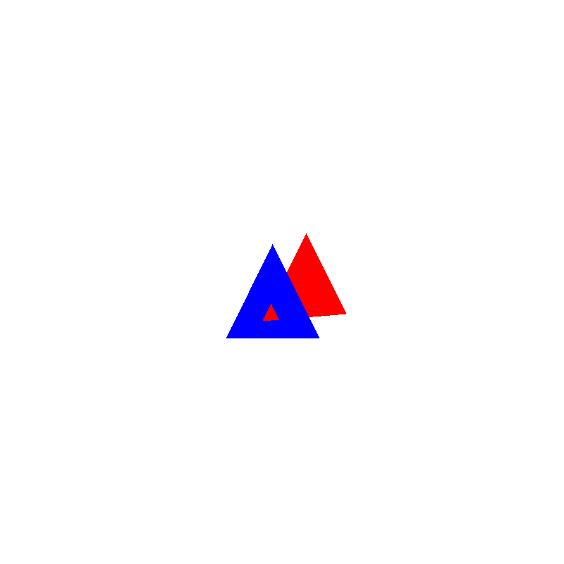

# EPL607 - Project Part 2

## Introduction
In this Project, we create a python program which receives the 3D coordinates of two triangles and 
generates a PNG image of these two triangles where the camera is located at the origin and is facing
towards the Z coordinate

## Members
- Antonis Katsiantonis
- Nikolas Vattis

## Programming Language and Libraries
For the implementation of the second part of this project we decided to use the same programming 
language (python) and library (pillow)

## Projection
In order to transform our shapes from 3D to 2D, we need to apply Perspective Projection into our 
shapes. This method applies the below formula to the x and y coordinates for each point of our 
shapes, where f is the focal length of our camera:

#### x = (f * x) / z

#### y = (f * y) / z

## Viewport Transformation
Now that we have the projected points, the next step is to transform these points so that they
are compatible with our screen resolution. For example, we know that our camera is located at 
the origin and is facing towards the z coordinate, so naturally we want the (0, 0) point to be 
located at the center of our screen, and generally we want our projected coordinates that range
from -1 to 1, to be converted into screen coordinates, ranging from 0 to WIDTH (and HEIGHT).

## Rasterization
Now that we have the 2D coordinates of our shapes, we now want to color the inside of our shapes.
In order to do this, we need to take 2 things into consideration for each Pixel:

* Is the pixel inside the shape? (We use edge function to determine this)
* Is the pixel covered by another shape? (We use z-buffer to determine this)

Initially, we find the Bounding Box (minX, maxX, minY, maxY) of our triangle in order to minimize
the area that we will scan. Now that we have our Bounding Box, we will loop every pixel inside
it, and for each pixel we will run the edge function for each line of the triangle. If we find
that the point is inside the triangle (w0 >= 0 and w1 >= 0 and w2 >= 0), then the only condition
left to check is for other shapes that might be covering the pixel that we want to draw. The way
we check this is by holding a z-buffer which holds the closest object for each pixel. So for our
pixel, if the z value of our pixel is closer to the z value of the z-buffer (iterations of 
previous shapes), then we should draw the pixel.

## Pixel Depth
In a simple implementation, we would be able to determine if one shape is closer to the camera 
compared to other shapes. But what if we have shapes where their one side is far from the camera
but the other side of the shape is closer to the camera? In that case, we want to know the depth
of each pixel instead of only knowing the depth of each shape. In order to do this, we follow a
process where we use the edge functions we calculated in the rasterization process (the formula
is displayed inside the get_inverse_depth function)

## Image Result

After the rasterization process, the Pillow library saves the generated image in a PNG file. We 
have generated two triangles, blue and red. The blue triangle is shown in the front, and it's 
covering the red triangle. 

## Image Result 2

We 
have generated two triangles, blue and red. The blue triangle is shown in the front, and it's 
covering the red triangle. However, the red triangle has it's top and right corners behind the 
blue triangle, but it's bottom-left corner is in the front of the blue triangle. This results
in the red triangle "piercing" the blue triangle
